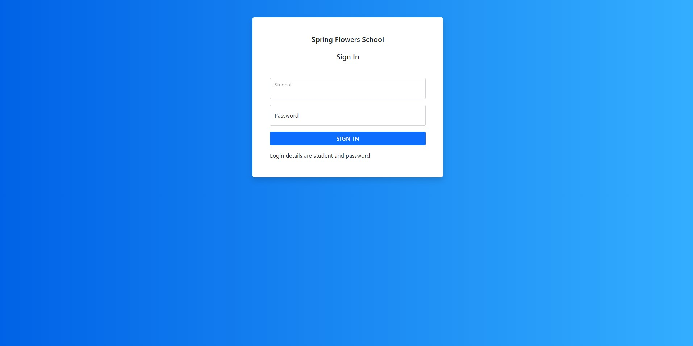
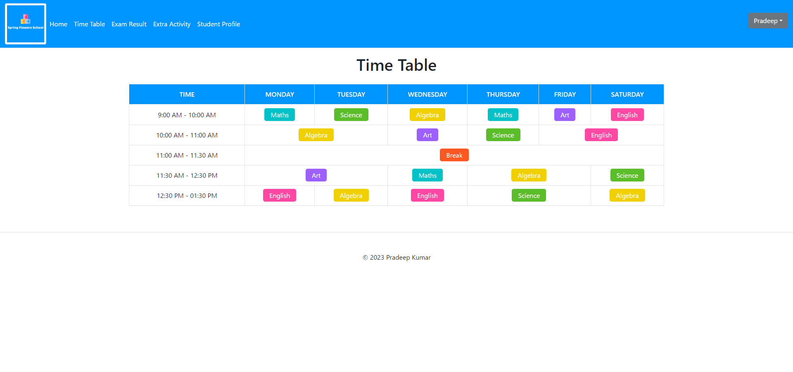
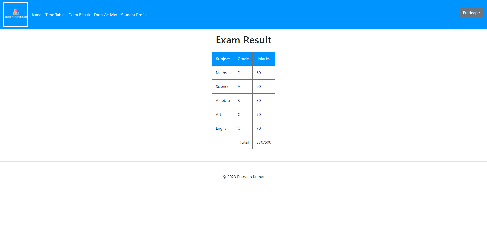
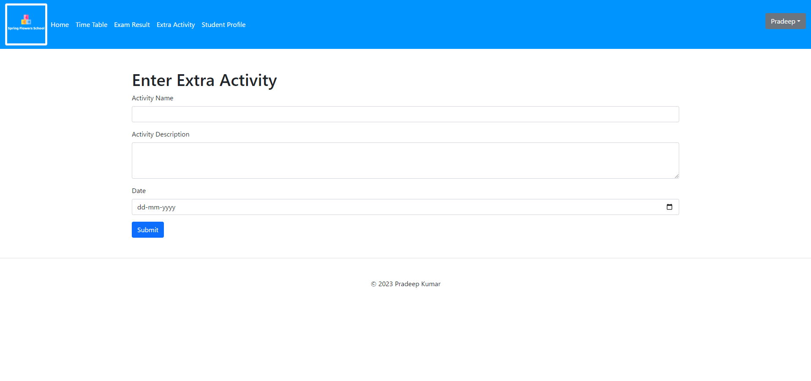
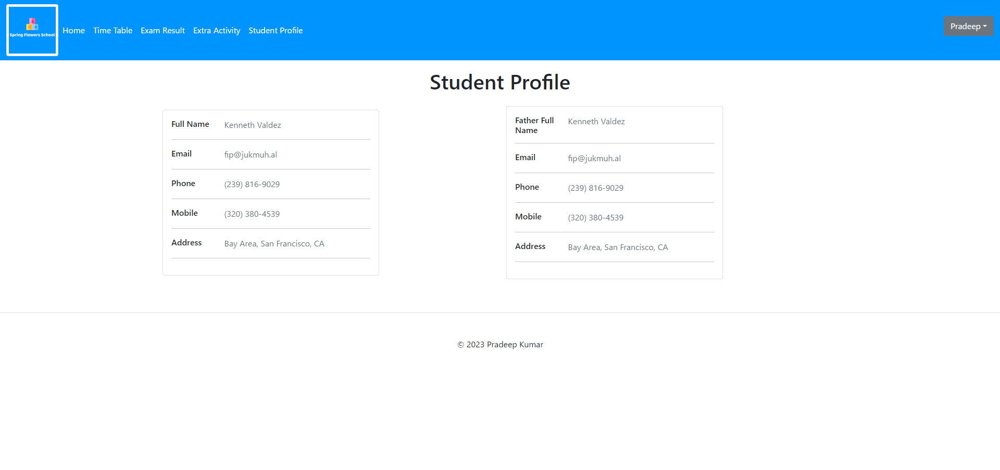

# School website Project
 
## Problem Statement - 1

## Student Management 

Spring Flowers school wants to create a online portal for their students.

## User Stories:- 

- As a student, I should be able to see the Welcome page of my application. 
- As a Student, I should be able to see a MENU bar and School logo in the welcome page.
- The MENU bar should contain the following options:
  - Time Table
  - Exam Result 
  - Extra Activity
  - Student Profile

## Problem Statement - 2 

## User Stories:- 

As a student, I should be able to see my Time Table in a new web page after clicking the timetable button.
As a student, I should be able to see my Information in a new web page after clicking the Student Profile Button. 
As a student, I should be able to see the grades of a student in a new webpage after clicking the exam results button. Subject should be selected from the drop box.

## Instructions:- 

Use HTML 5 and CSS 3 concept

Problem Statement - 3

# Student Management 

Spring Flowers school wants to create a online portal for their students.

## User Stories:- 

As a student, I should be able to see login page as a first page. In the login page, I should be able to enter my user name and password and click on the login button.
As a student, I should be able to see the Welcome page only if the student is valid. 
As a Student, I should be able to see my name on the top of the application on every page once I have logged in the application.
As a student, I should be able to enter the extra activities I have done for the day in a new page after clicking the Extra Activity Button. Once submitted I should be able to see the activity on the welcome page.
## Instructions:- 

Please use HTML 5 and CSS 3 concepts.
Use JavaScript for Onclick activities.

## Pages developed

### Login 

### Home 

### Timetable 

### Result 

### Activity

### Profile

